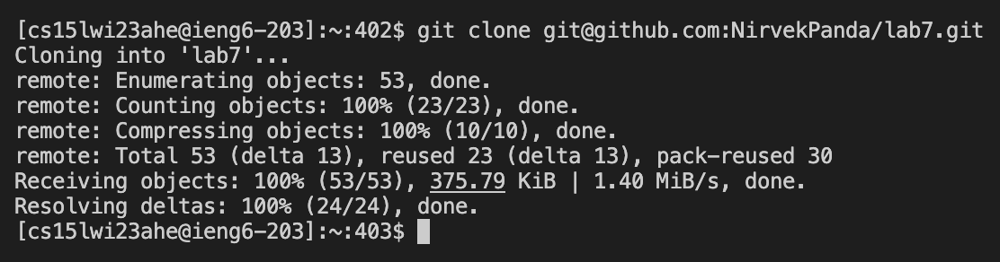
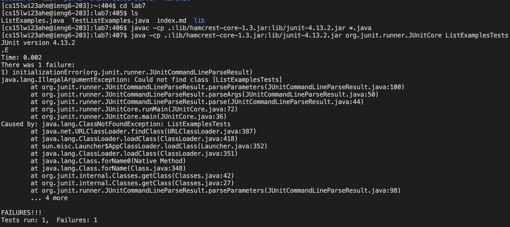
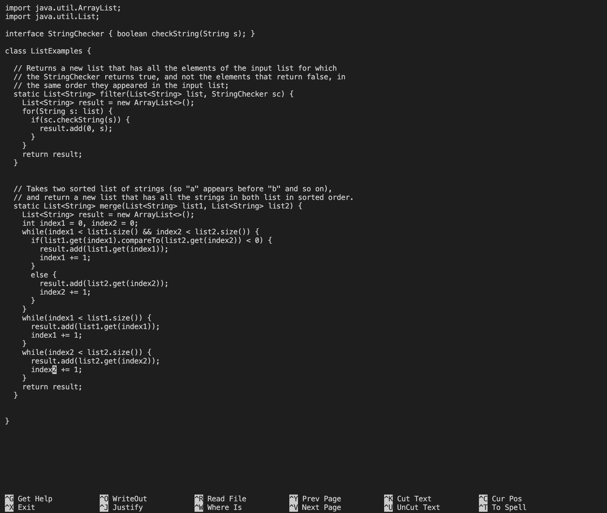
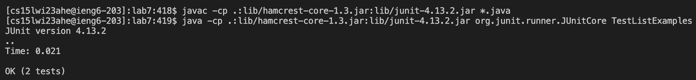
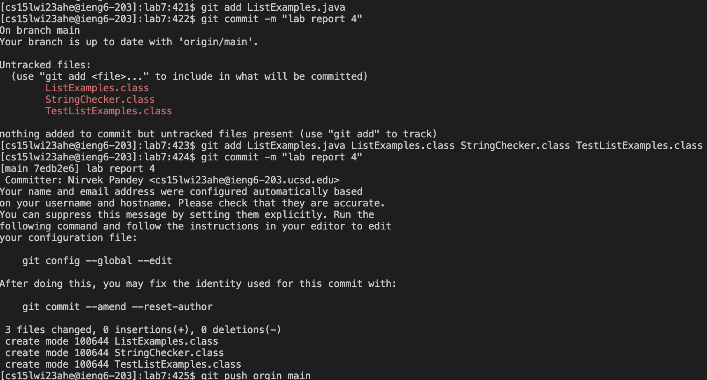

__**Lab Report 4**__

For the lab report this week, reproduce the task from the competition on your own. For each numbered step starting right after the timer (so steps 4-9), take a screenshot, and write down exactly which keys you pressed to get to that step. For special characters like <enter> or <tab>, write them in angle brackets with code formatting. Then, summarize the commands you ran and what the effect of those keypresses were.

__Clone Repository__
```
git clone git@github.com:NirvekPanda/lab7.git 
ls
cd lab7
ls
```

```
the first command clones a repo from a given source
cd changes the current directory to the new one
```
    
__Test Code__
```
javac -cp .:lib/hamcrest-core-1.3.jar:lib/junit-4.13.2.jar *.java
java -cp .:lib/hamcrest-core-1.3.jar:lib/junit-4.13.2.jar org.junit.runner.JUnitCore ListExamplesTests
```

```
the first command compiles all the files 
the second command runs the tester file
```

__Debug Code__    
```
nano ListExamples.java 
    <down> 42 times
    change 1 to 2 to update correct variables
Ctrl + O
Ctrl + X
```

```
nano opens the file
go down to the error and change it
save the changes
```
    

__Test Code Again__
```
javac -cp .:lib/hamcrest-core-1.3.jar:lib/junit-4.13.2.jar *.java
java -cp .:lib/hamcrest-core-1.3.jar:lib/junit-4.13.2.jar org.junit.runner.JUnitCore TestListExamples
```

```
tests come back working
```


__Commit and Push to Github__
```
git add ListExamples.java
git commit -m “lab report 4”
git push origin main
```

```
sends files back to github with the message
```
