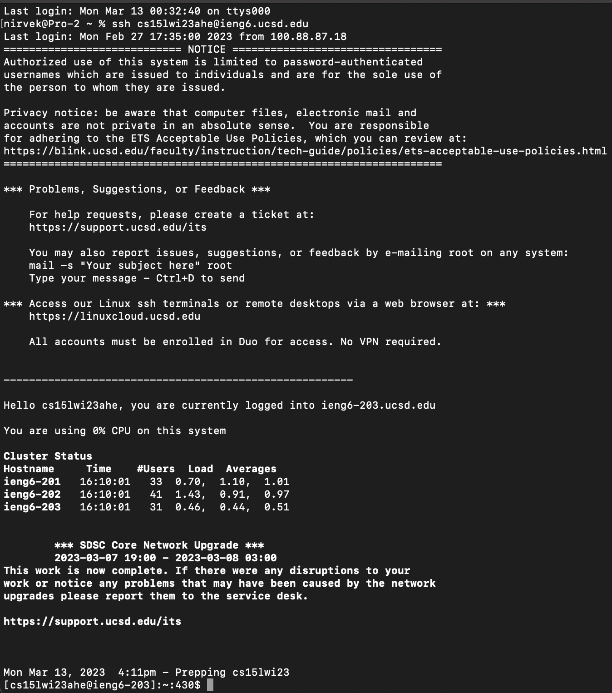
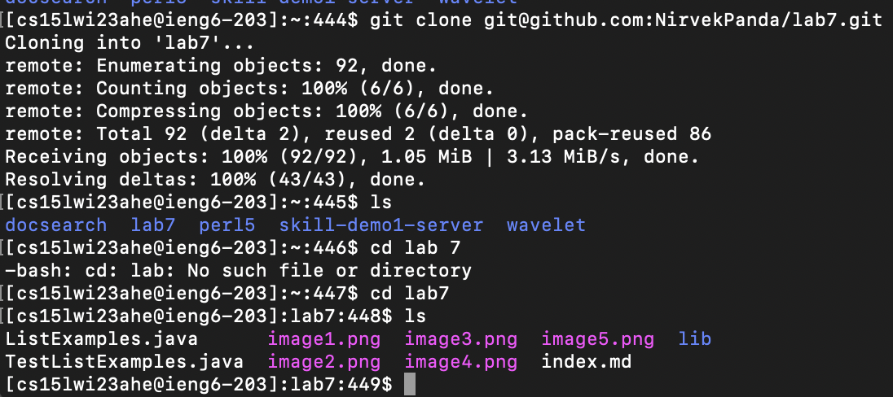
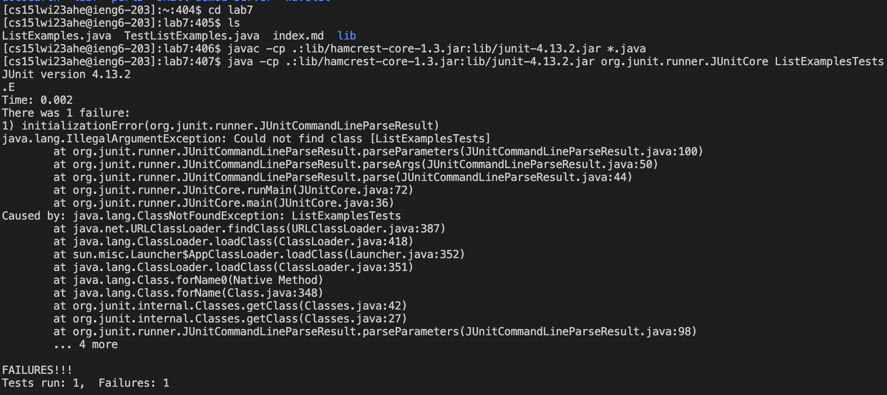
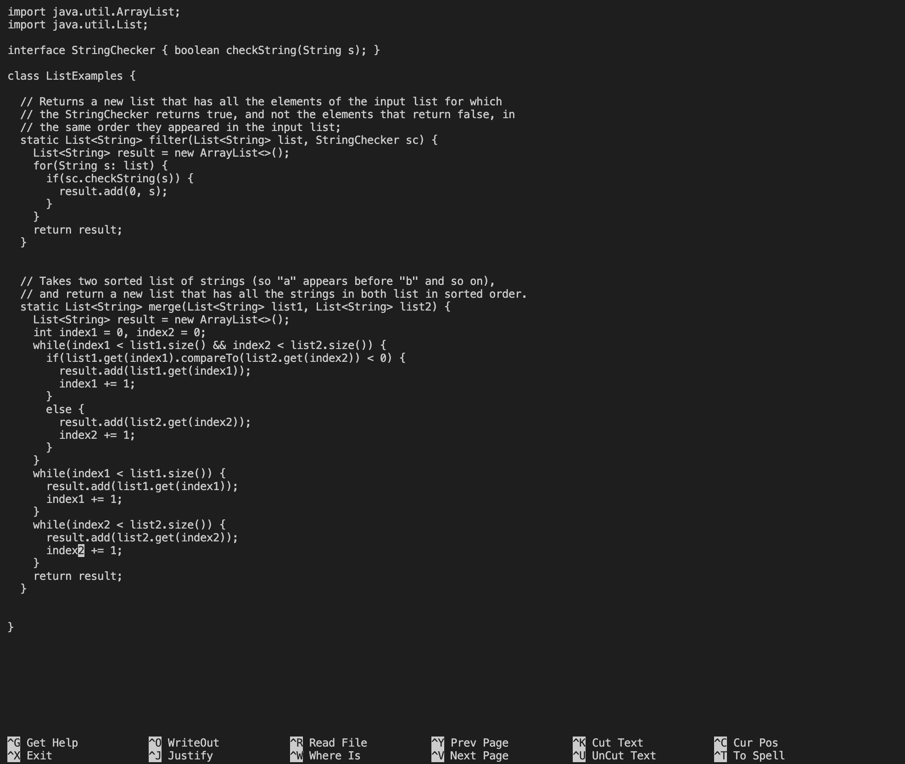
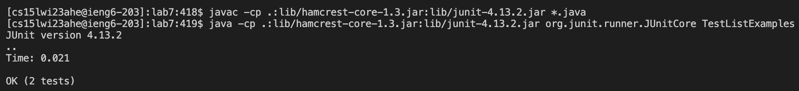
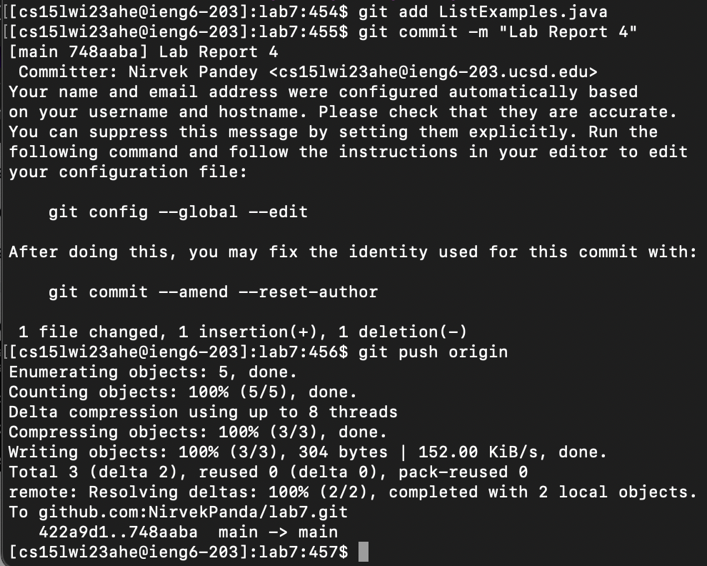

__**Lab Report 4**__

For the lab report this week, reproduce the task from the competition on your own. For each numbered step starting right after the timer (so steps 4-9), take a screenshot, and write down exactly which keys you pressed to get to that step. For special characters like <enter> or <tab>, write them in angle brackets with code formatting. Then, summarize the commands you ran and what the effect of those keypresses were.

__Login to ieng6__
```
ssh cs15lwi23ahe@ieng6.ucsd.edu
    <enter>
```

    
__Clone Repository__
```
git clone git@github.com:NirvekPanda/lab7.git 
    <enter>
ls
    <enter>
cd lab7
    <enter>
ls
    <enter>
```


    
__Test Code__
```
javac -cp .:lib/hamcrest-core-1.3.jar:lib/junit-4.13.2.jar *.java
    <enter>
java -cp .:lib/hamcrest-core-1.3.jar:lib/junit-4.13.2.jar org.junit.runner.JUnitCore ListExamplesTests
    <enter>
```



__Debug Code__    
```
nano ListExamples.java 
    <down> 32 times
    <right> 14 times
    <delete> 
    type <2>
<ctrl + o>
<ctrl + x>
```


    

__Test Code Again__
```
javac -cp .:lib/hamcrest-core-1.3.jar:lib/junit-4.13.2.jar *.java
    <enter>
java -cp .:lib/hamcrest-core-1.3.jar:lib/junit-4.13.2.jar org.junit.runner.JUnitCore TestListExamples
    <enter>
```



__Commit and Push to Github__
```
git add ListExamples.java
    <enter>
git commit -m “lab report 4”
    <enter>
git push origin
    <enter>
```

